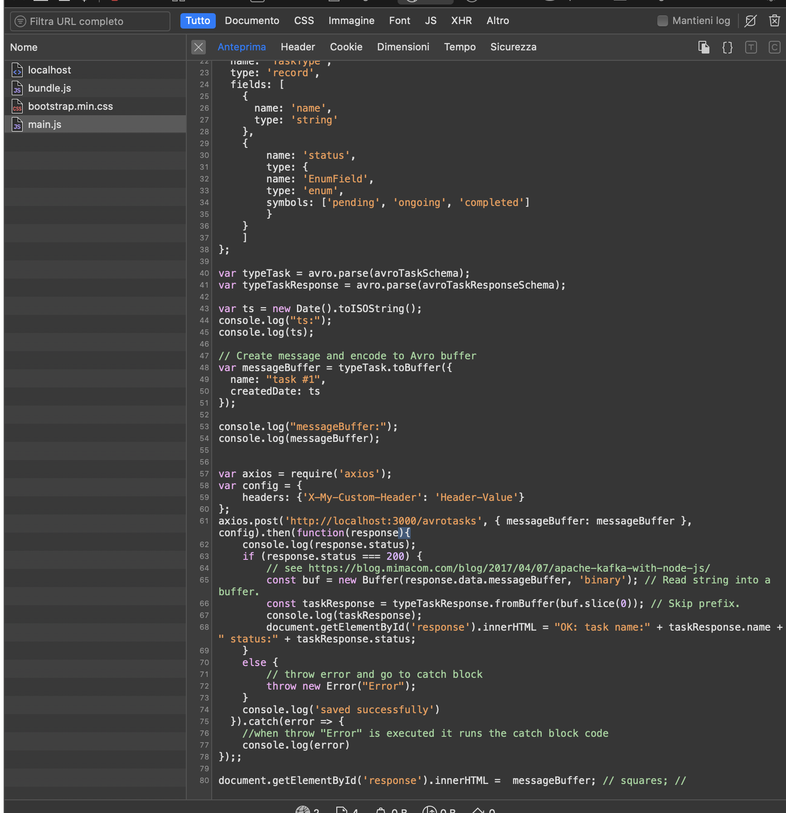
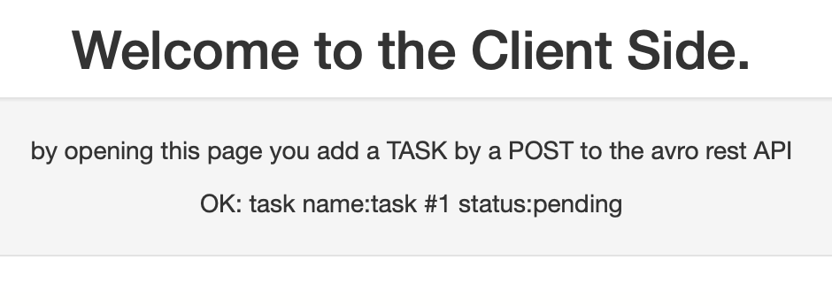

# avro-rest-js
simple lab applying [avsc](https://github.com/mtth/avsc) and learn by doing:

1. how to create a trivial nodejs express REST API server that receive and send avro buffer in request/response
2. how to call REST API that send and receive avro buffer client side javascript


# Badges
[](https://sonarcloud.io/dashboard?id=avro-rest-js)
<!--
[](https://sonarcloud.io/dashboard?id=avro-rest-js)
-->
[](https://sonarcloud.io/dashboard?id=avro-rest-js)

[](https://sonarcloud.io/dashboard?id=avro-rest-js)
[](https://sonarcloud.io/dashboard?id=avro-rest-js)
[](https://sonarcloud.io/dashboard?id=avro-rest-js)

[](https://sonarcloud.io/dashboard?id=avro-rest-js)
[](https://sonarcloud.io/dashboard?id=avro-rest-js)
[](https://sonarcloud.io/dashboard?id=avro-rest-js)
[](https://sonarcloud.io/dashboard?id=avro-rest-js)
[](https://sonarcloud.io/dashboard?id=avro-rest-js)

[](https://opensource.org/licenses/MIT)

## Getting started

### Clone the project

``` bash
git clone https://github.com/rondinif/avro-rest-js.git
```
### Install dependencies and dev-dependencies

``` bash
npm install
```

## Run and Debug
In this lab you want to open 3 terminals: 
 - one for mongodb ( start mongod and run queries in mongo shell )
 - one to run the sever-side ( classi NodeJS Express REST-API server on port 3000)
 - one to run the client-side ( html, javascript served on port 9090 )

and 1 browser: hopefully Chrome with DevTools for debugging client-side JS 

### Start Mongodb
#### if you have mongod istalled 
``` bash 
$ mongod --config  ${YOUR_MONGO_CONFIGURATION} 
```
#### if you want to run mongo in a container
```
$ cd docker 
$ docker-compose up
```
it should be enough to have an instance of mongodb daemon/server up and running in your developer workspace
into that instance we want some **documents** for out tests, so we seed (load) a couple of documents 
(from `docker/mongo-seed/init.json`) by using another docker container whose only purpose is to seed mongo

this seeding container uses [`mongoimport`](https://docs.mongodb.com/v4.2/reference/program/mongoimport/) 
 imports content from an Extended JSON file just copied from  `docker/mongo-seed/init.json`; we decide
 to name the db `Tododb` and `tasks` the  collection where our documents are loaded from `init.json`

see the file `docker/mongo-seed/Dockerfile`:
```
COPY init.json /init.json
CMD mongoimport --host 172.16.0.1 --db Tododb --collection tasks \
   --type json --file /init.json --jsonArray
```

`init.json` consists of a JsonArray which each item is a JsonObject that conforms to the structure defined in `api/models/todoListModel.js`
``` json
[
    {
      "name": "my first task",
      "Created_date": "1611408006998",
      "status": "pending"
    },
    {
      "name": "my second task",
      "Created_date": "1611408006998",
      "status": "ongoing"
    },
    {
      "name": "my third task",
      "Created_date": "1611408006998",
      "status": "completed"
    }  
]
```
in here I've filled up the value `1611408006998` for the `Create_date` field getting help from `node`: 
```
[avro-rest-js (master)]$ node 
Welcome to Node.js v12.16.0.
Type ".help" for more information.
> Date.now
[Function: now]
> Date.now()
1611408006998
```

in summary we have one container used to seed (load) data named `docker_mongo-seed_1` that exited once finished its task and one container named `docker_mongodb_1` listening on port `27017` for some client to connect and query our data.
```
[learningjson (master)]$ docker ps -a
CONTAINER ID   IMAGE               COMMAND                  CREATED         STATUS                     PORTS                      NAMES
09a2030d5b10   docker_mongo-seed   "docker-entrypoint.s…"   3 minutes ago   Exited (0) 3 minutes ago                              docker_mongo-seed_1
c1205047363a   mongo:4.2           "docker-entrypoint.s…"   3 minutes ago   Up 3 minutes               0.0.0.0:27017->27017/tcp   docker_mongodb_1
```


reading the **sysout** written by `docker-compose` can be of further help in understanding what happened:
<!-- mongo 3.2 
```
[docker (master)]$ docker-compose up
Starting docker_mongodb_1 ... done
Starting docker_mongo-seed_1 ... done
Attaching to docker_mongodb_1, docker_mongo-seed_1
mongodb_1     | 2021-01-23T11:26:55.245+0000 I CONTROL  [initandlisten] MongoDB starting : pid=1 port=27017 dbpath=/data/db 64-bit host=c745c1517d42
mongodb_1     | 2021-01-23T11:26:55.245+0000 I CONTROL  [initandlisten] db version v3.2.21
mongodb_1     | 2021-01-23T11:26:55.245+0000 I CONTROL  [initandlisten] git version: 1ab1010737145ba3761318508ff65ba74dfe8155
mongodb_1     | 2021-01-23T11:26:55.246+0000 I CONTROL  [initandlisten] OpenSSL version: OpenSSL 1.0.1t  3 May 2016
mongodb_1     | 2021-01-23T11:26:55.246+0000 I CONTROL  [initandlisten] allocator: tcmalloc
mongodb_1     | 2021-01-23T11:26:55.246+0000 I CONTROL  [initandlisten] modules: none
mongodb_1     | 2021-01-23T11:26:55.246+0000 I CONTROL  [initandlisten] build environment:
mongodb_1     | 2021-01-23T11:26:55.246+0000 I CONTROL  [initandlisten]     distmod: debian81
mongodb_1     | 2021-01-23T11:26:55.246+0000 I CONTROL  [initandlisten]     distarch: x86_64
mongodb_1     | 2021-01-23T11:26:55.246+0000 I CONTROL  [initandlisten]     target_arch: x86_64
mongodb_1     | 2021-01-23T11:26:55.246+0000 I CONTROL  [initandlisten] options: { net: { bindIp: "127.0.0.1,172.16.0.1" } }
mongodb_1     | 2021-01-23T11:26:55.249+0000 I -        [initandlisten] Detected data files in /data/db created by the 'wiredTiger' storage engine, so setting the active storage engine to 'wiredTiger'.
mongodb_1     | 2021-01-23T11:26:55.249+0000 I STORAGE  [initandlisten] wiredtiger_open config: create,cache_size=1G,session_max=20000,eviction=(threads_min=4,threads_max=4),config_base=false,statistics=(fast),log=(enabled=true,archive=true,path=journal,compressor=snappy),file_manager=(close_idle_time=100000),checkpoint=(wait=60,log_size=2GB),statistics_log=(wait=0),verbose=(recovery_progress),
mongodb_1     | 2021-01-23T11:26:55.328+0000 I STORAGE  [initandlisten] WiredTiger [1611401215:328435][1:0x7f6cab0b6cc0], txn-recover: Main recovery loop: starting at 3/4864
mongodb_1     | 2021-01-23T11:26:55.366+0000 I STORAGE  [initandlisten] WiredTiger [1611401215:366445][1:0x7f6cab0b6cc0], txn-recover: Recovering log 3 through 4
mongodb_1     | 2021-01-23T11:26:55.366+0000 I STORAGE  [initandlisten] WiredTiger [1611401215:366891][1:0x7f6cab0b6cc0], txn-recover: Recovering log 4 through 4
mongodb_1     | 2021-01-23T11:26:55.439+0000 I NETWORK  [HostnameCanonicalizationWorker] Starting hostname canonicalization worker
mongodb_1     | 2021-01-23T11:26:55.439+0000 I FTDC     [initandlisten] Initializing full-time diagnostic data capture with directory '/data/db/diagnostic.data'
mongodb_1     | 2021-01-23T11:26:55.439+0000 I NETWORK  [initandlisten] waiting for connections on port 27017
mongodb_1     | 2021-01-23T11:26:55.547+0000 I NETWORK  [initandlisten] connection accepted from 172.16.0.2:44086 #1 (1 connection now open)
mongo-seed_1  | 2021-01-23T11:26:55.548+0000	connected to: 172.16.0.1
mongo-seed_1  | 2021-01-23T11:26:55.549+0000	imported 2 documents
mongodb_1     | 2021-01-23T11:26:55.550+0000 I NETWORK  [conn1] end connection 172.16.0.2:44086 (0 connections now open)
docker_mongo-seed_1 exited with code 0
```
--> 
``` zsh 
[docker (master)]$ docker-compose up            
Pulling mongodb (mongo:4.2)...
4.2: Pulling from library/mongo
d519e2592276: Pull complete
d22d2dfcfa9c: Pull complete
b3afe92c540b: Pull complete
a2c1234bf134: Pull complete
05bf57f3b398: Pull complete
4737ab85f84c: Pull complete
6165557c172c: Pull complete
4f530ac8a5c0: Pull complete
f3b9a2e794c4: Pull complete
c9d6c8ba34dc: Pull complete
12d4a2a00a92: Pull complete
ef25165262d2: Pull complete
Digest: sha256:4d1aa6199d97e561b107cb79978c8620310e406e48ec6cf4e4b93c7ffd999833
Status: Downloaded newer image for mongo:4.2
           
Building mongo-seed
Step 1/3 : FROM mongo:4.2
 ---> 91262bc8eca4
Step 2/3 : COPY init.json /init.json
 ---> c48ef80251c1
Step 3/3 : CMD mongoimport --host 172.16.0.1 --db Tododb --collection tasks    --type json --file /init.json --jsonArray
 ---> Running in 137da85bd5e8
Removing intermediate container 137da85bd5e8
 ---> 214f4d0e3eb6

Successfully built 214f4d0e3eb6
Successfully tagged docker_mongo-seed:latest
WARNING: Image for service mongo-seed was built because it did not already exist. To rebuild this image you must use `docker-compose build` or `docker-compose up --build`.

Creating docker_mongodb_1 ... done
Creating docker_mongo-seed_1 ... done
Attaching to docker_mongodb_1, docker_mongo-seed_1
mongodb_1     | 2021-01-23T13:31:35.223+0000 I  CONTROL  [main] Automatically disabling TLS 1.0, to force-enable TLS 1.0 specify --sslDisabledProtocols 'none'
mongodb_1     | 2021-01-23T13:31:35.224+0000 W  ASIO     [main] No TransportLayer configured during NetworkInterface startup
mongodb_1     | 2021-01-23T13:31:35.225+0000 I  CONTROL  [initandlisten] MongoDB starting : pid=1 port=27017 dbpath=/data/db 64-bit host=c1205047363a
mongodb_1     | 2021-01-23T13:31:35.225+0000 I  CONTROL  [initandlisten] db version v4.2.11
mongodb_1     | 2021-01-23T13:31:35.225+0000 I  CONTROL  [initandlisten] git version: ea38428f0c6742c7c2c7f677e73d79e17a2aab96
mongodb_1     | 2021-01-23T13:31:35.225+0000 I  CONTROL  [initandlisten] OpenSSL version: OpenSSL 1.1.1  11 Sep 2018
mongodb_1     | 2021-01-23T13:31:35.225+0000 I  CONTROL  [initandlisten] allocator: tcmalloc
mongodb_1     | 2021-01-23T13:31:35.225+0000 I  CONTROL  [initandlisten] modules: none
mongodb_1     | 2021-01-23T13:31:35.225+0000 I  CONTROL  [initandlisten] build environment:
mongodb_1     | 2021-01-23T13:31:35.225+0000 I  CONTROL  [initandlisten]     distmod: ubuntu1804
mongodb_1     | 2021-01-23T13:31:35.225+0000 I  CONTROL  [initandlisten]     distarch: x86_64
mongodb_1     | 2021-01-23T13:31:35.225+0000 I  CONTROL  [initandlisten]     target_arch: x86_64
mongodb_1     | 2021-01-23T13:31:35.225+0000 I  CONTROL  [initandlisten] options: { net: { bindIp: "127.0.0.1,172.16.0.1" } }
mongodb_1     | 2021-01-23T13:31:35.226+0000 I  STORAGE  [initandlisten] 
mongodb_1     | 2021-01-23T13:31:35.226+0000 I  STORAGE  [initandlisten] ** WARNING: Using the XFS filesystem is strongly recommended with the WiredTiger storage engine
mongodb_1     | 2021-01-23T13:31:35.226+0000 I  STORAGE  [initandlisten] **          See http://dochub.mongodb.org/core/prodnotes-filesystem
mongodb_1     | 2021-01-23T13:31:35.226+0000 I  STORAGE  [initandlisten] wiredtiger_open config: create,cache_size=1457M,cache_overflow=(file_max=0M),session_max=33000,eviction=(threads_min=4,threads_max=4),config_base=false,statistics=(fast),log=(enabled=true,archive=true,path=journal,compressor=snappy),file_manager=(close_idle_time=100000,close_scan_interval=10,close_handle_minimum=250),statistics_log=(wait=0),verbose=[recovery_progress,checkpoint_progress],
mongodb_1     | 2021-01-23T13:31:35.704+0000 I  STORAGE  [initandlisten] WiredTiger message [1611408695:704145][1:0x7f4fb4544b00], txn-recover: Set global recovery timestamp: (0, 0)
mongodb_1     | 2021-01-23T13:31:35.711+0000 I  RECOVERY [initandlisten] WiredTiger recoveryTimestamp. Ts: Timestamp(0, 0)
mongodb_1     | 2021-01-23T13:31:35.719+0000 I  STORAGE  [initandlisten] No table logging settings modifications are required for existing WiredTiger tables. Logging enabled? 1
mongodb_1     | 2021-01-23T13:31:35.719+0000 I  STORAGE  [initandlisten] Timestamp monitor starting
mongodb_1     | 2021-01-23T13:31:35.723+0000 I  CONTROL  [initandlisten] 
mongodb_1     | 2021-01-23T13:31:35.723+0000 I  CONTROL  [initandlisten] ** WARNING: Access control is not enabled for the database.
mongodb_1     | 2021-01-23T13:31:35.723+0000 I  CONTROL  [initandlisten] **          Read and write access to data and configuration is unrestricted.
mongodb_1     | 2021-01-23T13:31:35.723+0000 I  CONTROL  [initandlisten] 
mongodb_1     | 2021-01-23T13:31:35.724+0000 I  STORAGE  [initandlisten] createCollection: admin.system.version with provided UUID: 04f515ef-8dea-4339-ab59-bcf09cafd0f2 and options: { uuid: UUID("04f515ef-8dea-4339-ab59-bcf09cafd0f2") }
mongodb_1     | 2021-01-23T13:31:35.731+0000 I  INDEX    [initandlisten] index build: done building index _id_ on ns admin.system.version
mongodb_1     | 2021-01-23T13:31:35.731+0000 I  SHARDING [initandlisten] Marking collection admin.system.version as collection version: <unsharded>
mongodb_1     | 2021-01-23T13:31:35.731+0000 I  COMMAND  [initandlisten] setting featureCompatibilityVersion to 4.2
mongodb_1     | 2021-01-23T13:31:35.732+0000 I  SHARDING [initandlisten] Marking collection local.system.replset as collection version: <unsharded>
mongodb_1     | 2021-01-23T13:31:35.732+0000 I  STORAGE  [initandlisten] Flow Control is enabled on this deployment.
mongodb_1     | 2021-01-23T13:31:35.732+0000 I  SHARDING [initandlisten] Marking collection admin.system.roles as collection version: <unsharded>
mongodb_1     | 2021-01-23T13:31:35.732+0000 I  STORAGE  [initandlisten] createCollection: local.startup_log with generated UUID: d64df6b9-eaf9-42b9-a0f3-2adca83c69bb and options: { capped: true, size: 10485760 }
mongodb_1     | 2021-01-23T13:31:35.740+0000 I  INDEX    [initandlisten] index build: done building index _id_ on ns local.startup_log
mongodb_1     | 2021-01-23T13:31:35.740+0000 I  SHARDING [initandlisten] Marking collection local.startup_log as collection version: <unsharded>
mongodb_1     | 2021-01-23T13:31:35.741+0000 I  FTDC     [initandlisten] Initializing full-time diagnostic data capture with directory '/data/db/diagnostic.data'
mongodb_1     | 2021-01-23T13:31:35.743+0000 I  SHARDING [LogicalSessionCacheRefresh] Marking collection config.system.sessions as collection version: <unsharded>
mongodb_1     | 2021-01-23T13:31:35.743+0000 I  NETWORK  [listener] Listening on /tmp/mongodb-27017.sock
mongodb_1     | 2021-01-23T13:31:35.744+0000 I  NETWORK  [listener] Listening on 127.0.0.1
mongodb_1     | 2021-01-23T13:31:35.744+0000 I  NETWORK  [listener] Listening on 172.16.0.1
mongodb_1     | 2021-01-23T13:31:35.744+0000 I  STORAGE  [LogicalSessionCacheRefresh] createCollection: config.system.sessions with provided UUID: 81644845-3aab-4aac-96f0-190f5871a88d and options: { uuid: UUID("81644845-3aab-4aac-96f0-190f5871a88d") }
mongodb_1     | 2021-01-23T13:31:35.744+0000 I  NETWORK  [listener] waiting for connections on port 27017
mongodb_1     | 2021-01-23T13:31:35.744+0000 I  CONTROL  [LogicalSessionCacheReap] Sessions collection is not set up; waiting until next sessions reap interval: config.system.sessions does not exist
mongodb_1     | 2021-01-23T13:31:35.752+0000 I  INDEX    [LogicalSessionCacheRefresh] index build: done building index _id_ on ns config.system.sessions
mongodb_1     | 2021-01-23T13:31:35.760+0000 I  INDEX    [LogicalSessionCacheRefresh] index build: starting on config.system.sessions properties: { v: 2, key: { lastUse: 1 }, name: "lsidTTLIndex", ns: "config.system.sessions", expireAfterSeconds: 1800 } using method: Hybrid
mongodb_1     | 2021-01-23T13:31:35.760+0000 I  INDEX    [LogicalSessionCacheRefresh] build may temporarily use up to 200 megabytes of RAM
mongodb_1     | 2021-01-23T13:31:35.760+0000 I  INDEX    [LogicalSessionCacheRefresh] index build: collection scan done. scanned 0 total records in 0 seconds
mongodb_1     | 2021-01-23T13:31:35.761+0000 I  INDEX    [LogicalSessionCacheRefresh] index build: inserted 0 keys from external sorter into index in 0 seconds
mongodb_1     | 2021-01-23T13:31:35.762+0000 I  INDEX    [LogicalSessionCacheRefresh] index build: done building index lsidTTLIndex on ns config.system.sessions
mongodb_1     | 2021-01-23T13:31:36.001+0000 I  SHARDING [ftdc] Marking collection local.oplog.rs as collection version: <unsharded>
mongodb_1     | 2021-01-23T13:31:36.091+0000 I  NETWORK  [listener] connection accepted from 172.16.0.2:44168 #1 (1 connection now open)
mongodb_1     | 2021-01-23T13:31:36.092+0000 I  NETWORK  [conn1] received client metadata from 172.16.0.2:44168 conn1: { driver: { name: "mongo-go-driver", version: "v1.2.1" }, os: { type: "linux", architecture: "amd64" }, platform: "go1.12.17" }
mongodb_1     | 2021-01-23T13:31:36.093+0000 I  NETWORK  [listener] connection accepted from 172.16.0.2:44170 #2 (2 connections now open)
mongodb_1     | 2021-01-23T13:31:36.094+0000 I  NETWORK  [conn2] received client metadata from 172.16.0.2:44170 conn2: { driver: { name: "mongo-go-driver", version: "v1.2.1" }, os: { type: "linux", architecture: "amd64" }, platform: "go1.12.17", application: { name: "mongoimport" } }
mongo-seed_1  | 2021-01-23T13:31:36.095+0000	connected to: mongodb://172.16.0.1/
mongodb_1     | 2021-01-23T13:31:36.096+0000 I  SHARDING [conn2] Marking collection Tododb.tasks as collection version: <unsharded>
mongodb_1     | 2021-01-23T13:31:36.097+0000 I  STORAGE  [conn2] createCollection: Tododb.tasks with generated UUID: 2559e115-9aa2-4ef2-9c4d-51253881e0bd and options: {}
mongodb_1     | 2021-01-23T13:31:36.106+0000 I  INDEX    [conn2] index build: done building index _id_ on ns Tododb.tasks
mongo-seed_1  | 2021-01-23T13:31:36.106+0000	3 document(s) imported successfully. 0 document(s) failed to import.
mongodb_1     | 2021-01-23T13:31:36.107+0000 I  NETWORK  [conn2] end connection 172.16.0.2:44170 (1 connection now open)
mongodb_1     | 2021-01-23T13:31:36.107+0000 I  NETWORK  [conn1] end connection 172.16.0.2:44168 (0 connections now open)
```

as you can see fron the *sysout*
#### CONTROL and NETWORK
as you can see see at `docker/docker-compose.yml`
we start **monngod** (the mongodb daemon or server) in the first contairer with `mongod --bind_ip 127.0.0.1,172.16.0.1`
that is we create the network `172.16.0.1` and bind the database service to it.
in the **sysout** we could observe:
-  `net: { bindIp: "127.0.0.1,172.16.0.1"` 
  - waiting for connections on port 27017
  - connection accepted from 172.16.0.2:44086 
  - `imported 2 documents` : see at `docker/mongo-seed/init.json` to view the imported document; see [this question](https://stackoverflow.com/questions/31210973/how-do-i-seed-a-mongo-database-using-docker-compose) and [answer](https://stackoverflow.com/a/33397913/1657028) to learn more about seedig mongodb running on a container by a seeding container running aside.
  - connected to: 172.16.0.1
  end connection 172.16.0.2:44086
#### STORAGE 
-  /data/db
  - [learn more on WiredTiger Storage Engine from the MONGODB MANUAL](https://docs.mongodb.com/manual/core/wiredtiger/)
  WiredTiger is the default storage engine starting in MongoDB 3.2. It is well-suited for most workloads and is recommended for new deployments. WiredTiger provides a document-level concurrency model, checkpointing, and compression, among other features. In MongoDB Enterprise, WiredTiger also supports Encryption at Rest.

in the **sysout** we could observe:
```
wiredtiger_open config: 
  - create,
  - cache_size=1G,
  - session_max=20000,
  - eviction=(threads_min=4,threads_max=4),
  - config_base=false,
  - statistics=(fast),
  - log=(enabled=true,archive=true,path=journal,compressor=snappy),
  - file_manager=(close_idle_time=100000),
  - checkpoint=(wait=60,log_size=2GB),
  - statistics_log=(wait=0),
  - verbose=(recovery_progress),
```

#### important note about changing data in `init.json``
please note that wehen stopping and restarting containers with the `docker-compose up` 
if you already have stopped containers and ad old 
`docker_mongo-seed` image that same image will be used when restarting, 
therefore if you've changed `init.json` data, there are still old data into the `docker_mongo-seed` image , 
so I suggest you to remove stopped container and delete `docker_mongo-seed` each time data are changed in `init.json` : 
``` zsh 
$ docker rm  docker_mongo-seed_1
$ docker rmi docker_mongo-seed
```


#### if you want to install locally only the `mongo` client 
```
$ brew tap mongodb/brew
$ brew install mongodb-community-shell
```

### Start Server side API

``` bash
$ npm run start
```
or:
``` bash 
$ DEBUG=api:* npm start
```

### Build and Start Client web-app with python
``` bash
$ npm --ignore-scripts=false run build-client-side

> avro-rest-js@0.1.0 build-client-side /Users/ronda/projects/learning-avro/lab05-avro-rest/avro-rest-js
> browserify ./client-side/main.js -o ./client-side/bundle.js --debug

$ npm --ignore-scripts=false run serve-client-side

> avro-rest-js@0.1.1 serve-client-side /Users/ronda/projects/rondinif/avro-rest-js
> cd client-side;  python -m SimpleHTTPServer 9090 ; cd ..

Serving HTTP on 0.0.0.0 port 9090 ...
```

### ...or start Client web-app with light-server
``` bash
$ npm --ignore-scripts=false run start-client-side

> avro-rest-js@0.1.1 start-client-side /Users/ronda/projects/rondinif/avro-rest-js
> npx light-server -s ./client-side -p 9090 -w 'client-side/**/*.js, client-side/**/*.html'

light-server is listening at http://0.0.0.0:9090
  serving static dir: ./client-side

light-server is watching these files: client-side/**/*.js, client-side/**/*.html
  when file changes,
  this event will be sent to browser: reload
```

## Connect the mongo client to perform sone queries 
### if you have `mongod` installed and want to use the local `mongo` client
```
$ mongo
MongoDB shell version: 3.0.3
connecting to: test
```
### if run `mongod in a container` and want to use the `mongo` client installed on the host
launch `mongo` client and specify the name of the mongo container
``` zsh
$ mongo docker_mongodb_1
MongoDB shell version v4.2.0
connecting to: mongodb://127.0.0.1:27017/docker_mongodb_1?compressors=disabled&gssapiServiceName=mongodb
```
the log on the mongod shows you the connection etablished:
```
mongodb_1     | 2021-01-23T12:49:12.752+0000 I NETWORK  [initandlisten] connection accepted from 172.16.0.254:63774 #2 (1 connection now open)
mongodb_1     | 2021-01-23T12:49:12.752+0000 I NETWORK  [conn2] received client metadata from 172.16.0.254:63774 conn2: { application: { name: "MongoDB Shell" }, driver: { name: "MongoDB Internal Client", version: "4.2.0" }, os: { type: "Darwin", name: "Mac OS X", architecture: "x86_64", version: "19.6.0" } }
```

### if run `mongod in a container` and want to use the `mongo` client from the container 
```
$ docker ps                               
CONTAINER ID        IMAGE               COMMAND                  CREATED             STATUS              PORTS                      NAMES
a2315a01ae43        mongo:3.2           "docker-entrypoint.s…"   About an hour ago   Up 6 seconds        0.0.0.0:27017->27017/tcp   docker_mongodb_1

$ docker exec -it docker_mongodb_1 /bin/bash
```

### perform some queries
```
> show dbs
Tododb  0.078GB
> use Tododb
switched to db Tododb
> db.getCollectionNames()
[ "system.indexes", "tasks" ]
> db.tasks.find()
```

#### full session example:
``` zsh
[docker (master)]$  mongo docker_mongodb_1
MongoDB shell version v4.2.0
connecting to: mongodb://127.0.0.1:27017/docker_mongodb_1?compressors=disabled&gssapiServiceName=mongodb
Implicit session: session { "id" : UUID("2a917d08-6bde-4772-a04c-2547ae676fa1") }
MongoDB server version: 4.2.11
Server has startup warnings: 
2021-01-23T13:31:35.226+0000 I  STORAGE  [initandlisten] 
2021-01-23T13:31:35.226+0000 I  STORAGE  [initandlisten] ** WARNING: Using the XFS filesystem is strongly recommended with the WiredTiger storage engine
2021-01-23T13:31:35.226+0000 I  STORAGE  [initandlisten] **          See http://dochub.mongodb.org/core/prodnotes-filesystem
2021-01-23T13:31:35.723+0000 I  CONTROL  [initandlisten] 
2021-01-23T13:31:35.723+0000 I  CONTROL  [initandlisten] ** WARNING: Access control is not enabled for the database.
2021-01-23T13:31:35.723+0000 I  CONTROL  [initandlisten] **          Read and write access to data and configuration is unrestricted.
2021-01-23T13:31:35.723+0000 I  CONTROL  [initandlisten] 
---
Enable MongoDB's free cloud-based monitoring service, which will then receive and display
metrics about your deployment (disk utilization, CPU, operation statistics, etc).

The monitoring data will be available on a MongoDB website with a unique URL accessible to you
and anyone you share the URL with. MongoDB may use this information to make product
improvements and to suggest MongoDB products and deployment options to you.

To enable free monitoring, run the following command: db.enableFreeMonitoring()
To permanently disable this reminder, run the following command: db.disableFreeMonitoring()
---

> show dbs
Tododb  0.000GB
admin   0.000GB
config  0.000GB
local   0.000GB
> use test
switched to db test
> db.getCollectionNames()
[ ]
> use Tododb
switched to db Tododb
> db.getCollectionNames()
[ "tasks" ]
> db.tasks.find()
{ "_id" : ObjectId("600c253884dbd358b1475fb1"), "name" : "my second task", "Created_date" : "1611408006998", "status" : "ongoing" }
{ "_id" : ObjectId("600c253884dbd358b1475fb2"), "name" : "my third task", "Created_date" : "1611408006998", "status" : "completed" }
{ "_id" : ObjectId("600c253884dbd358b1475fb3"), "name" : "my first task", "Created_date" : "1611408006998", "status" : "pending" }
>  
```

## start the  API server 
```
[avro-rest-js (master)]$ npm run start-server

> avro-rest-js@0.1.2 start-server /Users/ronda/projects/rondinif/avro-rest-js
> nodemon server.js

[nodemon] 1.19.4
[nodemon] to restart at any time, enter `rs`
[nodemon] watching dir(s): *.*
[nodemon] watching extensions: js,mjs,json
[nodemon] starting `node server.js`
todo list RESTful API server started on: 3000
(node:61062) DeprecationWarning: current URL string parser is deprecated, and will be removed in a future version. To use the new parser, pass option { useNewUrlParser: true } to MongoClient.connect.
(node:61062) DeprecationWarning: current Server Discovery and Monitoring engine is deprecated, and will be removed in a future version. To use the new Server Discover and Monitoring engine, pass option { useUnifiedTopology: true } to the MongoClient constructor.
```

### check the server response to an API call 
``` json
$ curl -s http://localhost:3000/tasks | jq
[
  {
    "status": [
      "ongoing"
    ],
    "_id": "600c253884dbd358b1475fb1",
    "name": "my second task",
    "Created_date": "2021-01-23T13:20:06.998Z"
  },
  {
    "status": [
      "completed"
    ],
    "_id": "600c253884dbd358b1475fb2",
    "name": "my third task",
    "Created_date": "2021-01-23T13:20:06.998Z"
  },
  {
    "status": [
      "pending"
    ],
    "_id": "600c253884dbd358b1475fb3",
    "name": "my first task",
    "Created_date": "2021-01-23T13:20:06.998Z"
  }
]
```


## build, serve and run client side 
to build and serve
```
npm run build-client-side
npm run serve-client-side
```

to run run the client-side in the browser
### open http://localhost:9090
look at the page and the code in brower


### check express server API log 
```
{
  messageBuffer: {
    type: 'Buffer',
    data: [
      14, 116, 97, 115, 107, 32, 35, 49, 48,
      50,  48, 50,  49,  45, 48, 49, 45, 50,
      51,  84, 49,  52,  58, 49, 54, 58, 49,
      51,  46, 54,  54,  52, 90
    ]
  }
}
value:
[
  14, 116, 97, 115, 107, 32, 35, 49, 48,
  50,  48, 50,  49,  45, 48, 49, 45, 50,
  51,  84, 49,  52,  58, 49, 54, 58, 49,
  51,  46, 54,  54,  52, 90
]
TaskType { name: 'task #1', createdDate: '2021-01-23T14:16:13.664Z' }
new_task:
{
  status: [ 'pending' ],
  _id: 600c2fad42f467e69c1c15ae,
  name: 'task #1',
  Created_date: 2021-01-23T14:16:13.750Z
}

```
### check new data inserted by running the client-side 
#### from the API 
``` json
[avro-rest-js (master)]$ curl -s http://localhost:3000/tasks | jq
[
  {
    "status": [
      "ongoing"
    ],
    "_id": "600c253884dbd358b1475fb1",
    "name": "my second task",
    "Created_date": "2021-01-23T13:20:06.998Z"
  },
  {
    "status": [
      "completed"
    ],
    "_id": "600c253884dbd358b1475fb2",
    "name": "my third task",
    "Created_date": "2021-01-23T13:20:06.998Z"
  },
  {
    "status": [
      "pending"
    ],
    "_id": "600c253884dbd358b1475fb3",
    "name": "my first task",
    "Created_date": "2021-01-23T13:20:06.998Z"
  },
  {
    "status": [
      "pending"
    ],
    "_id": "600c2fad42f467e69c1c15ae",
    "name": "task #1",
    "Created_date": "2021-01-23T14:16:13.750Z",
    "__v": 0
  }
]
```
#### from the db
```
> db.tasks.find()
{ "_id" : ObjectId("600c253884dbd358b1475fb1"), "name" : "my second task", "Created_date" : "1611408006998", "status" : "ongoing" }
{ "_id" : ObjectId("600c253884dbd358b1475fb2"), "name" : "my third task", "Created_date" : "1611408006998", "status" : "completed" }
{ "_id" : ObjectId("600c253884dbd358b1475fb3"), "name" : "my first task", "Created_date" : "1611408006998", "status" : "pending" }
{ "_id" : ObjectId("600c2fad42f467e69c1c15ae"), "status" : [ "pending" ], "name" : "task #1", "Created_date" : ISODate("2021-01-23T14:16:13.750Z"), "__v" : 0 }
```
